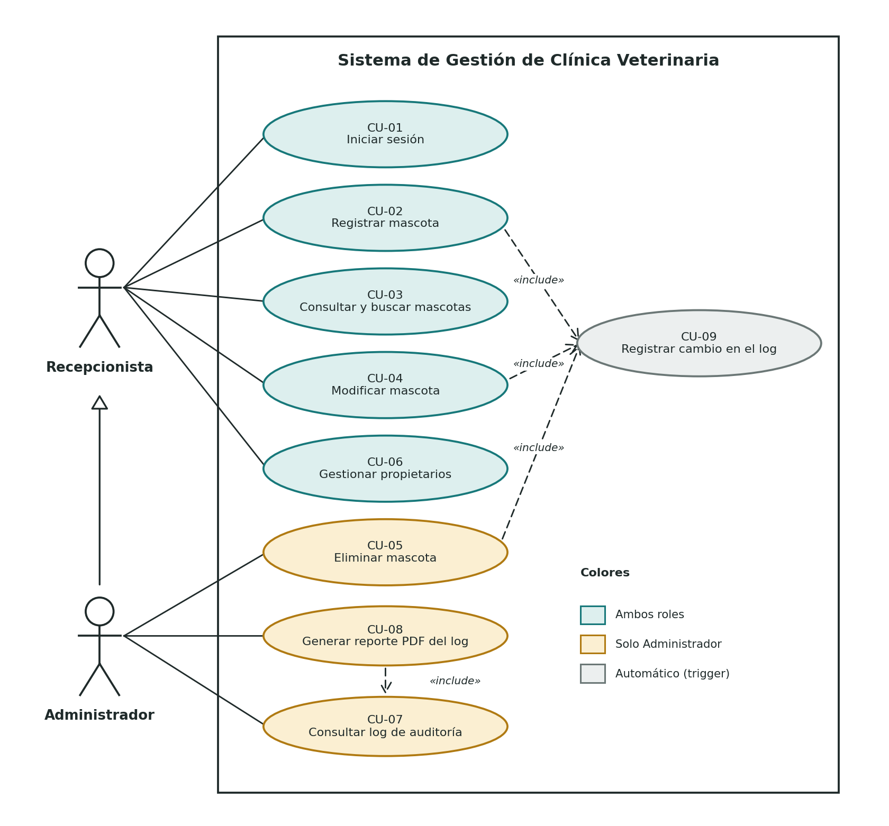

# Diagrama de Casos de Uso

Sistema de gestión para una clínica veterinaria

Este diagrama muestra qué puede hacer cada tipo de usuario dentro del sistema. Sale directamente de los requerimientos funcionales del documento `02_requerimientos.md`.

## 1. Actores

| Actor | Descripción |
|-------|-------------|
| Recepcionista | Atiende a los clientes. Registra, busca y modifica mascotas y propietarios. |
| Administrador | Está a cargo de la clínica. Hace todo lo que hace la Recepcionista y además elimina mascotas, revisa el log y genera el reporte PDF. |
| Sistema (trigger) | No es una persona. Es el trigger de la base de datos que guarda cada cambio en el log. Por eso aparece como caso de uso incluido y no como actor. |

## 2. Diagrama

### Cómo leerlo

- Las líneas continuas unen a un actor con lo que puede hacer.
- **Administrador hereda de Recepcionista**: puede hacer todos los casos de uso de la Recepcionista, por eso no se repiten las líneas.
- **include** (flecha punteada) significa que un caso de uso siempre usa a otro. Registrar, modificar o eliminar una mascota siempre dispara el registro en el log (CU-09), y para generar el PDF primero se consulta el log con sus filtros (CU-07).
- Todos los casos de uso, menos CU-01, necesitan que el usuario ya haya iniciado sesión.

## 3. Especificación de los casos de uso

| ID | Caso de uso | Actor | RF | Descripción |
|----|-------------|-------|----|-------------|
| CU-01 | Iniciar sesión | Recepcionista, Administrador | RF-01 | El usuario ingresa su usuario y clave. Si son correctos entra con su rol. Tras 3 intentos fallidos la cuenta se bloquea. |
| CU-02 | Registrar mascota | Recepcionista, Administrador | RF-02 | Se ingresan los datos de la mascota y se asocia a un propietario y una especie. |
| CU-03 | Consultar y buscar mascotas | Recepcionista, Administrador | RF-03 | Se listan las mascotas y se pueden buscar por nombre, especie o propietario. |
| CU-04 | Modificar mascota | Recepcionista, Administrador | RF-04 | Se cambian los datos de una mascota ya registrada. |
| CU-05 | Eliminar mascota | Administrador | RF-05 | Se elimina una mascota después de confirmar la acción. |
| CU-06 | Gestionar propietarios | Recepcionista, Administrador | RF-06 | Se registran, consultan y modifican los datos de los propietarios. |
| CU-07 | Consultar log de auditoría | Administrador | RF-08 | Se revisan los cambios registrados, filtrando por fecha, usuario y acción. |
| CU-08 | Generar reporte PDF del log | Administrador | RF-09 | Se genera un PDF con el log filtrado, con la fecha de emisión y el usuario que lo generó. |
| CU-09 | Registrar cambio en el log | Sistema (trigger) | RF-07 | Cada INSERT, UPDATE o DELETE sobre Mascota queda guardado automáticamente en LogAuditoria. |

## 4. Relación con el CRUD

El mantenedor de la entidad principal (Mascota) queda cubierto así:

| Operación | Caso de uso |
|-----------|-------------|
| Crear | CU-02 Registrar mascota |
| Leer | CU-03 Consultar y buscar mascotas |
| Actualizar | CU-04 Modificar mascota |
| Eliminar | CU-05 Eliminar mascota |
