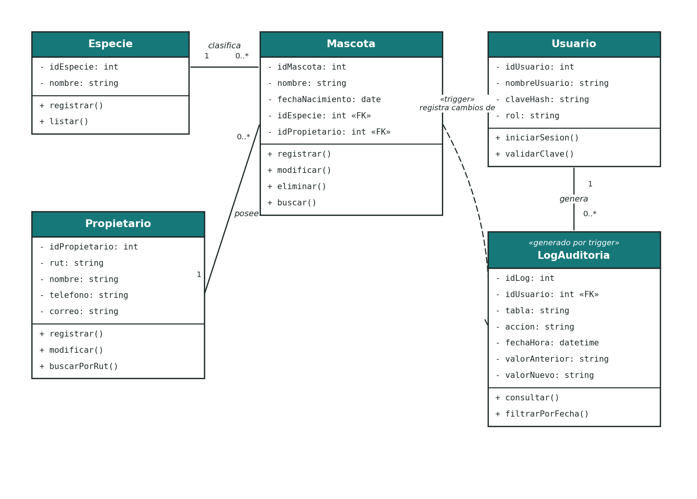

# Diagrama de Clases

Sistema de gestión para una clínica veterinaria

Este diagrama sale del modelo de datos que necesita el sistema: mascotas, propietarios, especies, usuarios y el log de auditoría. De aquí se deriva después el modelo relacional de la base de datos.

## 1. Diagrama

## 2. Descripción de las clases

### Propietario
Representa al dueño de una mascota.

| Atributo | Tipo | Visibilidad |
|----------|------|-------------|
| idPropietario | int | privado |
| rut | string | privado |
| nombre | string | privado |
| telefono | string | privado |
| correo | string | privado |

Métodos: `registrar()`, `modificar()`, `buscarPorRut()`.

### Especie
Catálogo de especies (perro, gato, ave, etc.), para no repetir texto libre en cada mascota.

| Atributo | Tipo | Visibilidad |
|----------|------|-------------|
| idEspecie | int | privado |
| nombre | string | privado |

Métodos: `registrar()`, `listar()`.

### Mascota
Es la entidad principal del mantenedor. Concentra el CRUD del sistema.

| Atributo | Tipo | Visibilidad |
|----------|------|-------------|
| idMascota | int | privado |
| nombre | string | privado |
| fechaNacimiento | date | privado |
| idEspecie | int (FK a Especie) | privado |
| idPropietario | int (FK a Propietario) | privado |

Métodos: `registrar()`, `modificar()`, `eliminar()`, `buscar()`.

### Usuario
Personal de la clínica que inicia sesión en el sistema (Administrador o Recepcionista).

| Atributo | Tipo | Visibilidad |
|----------|------|-------------|
| idUsuario | int | privado |
| nombreUsuario | string | privado |
| claveHash | string | privado |
| rol | string | privado |

Métodos: `iniciarSesion()`, `validarClave()`.

### LogAuditoria
Guarda cada cambio hecho sobre Mascota. No se llena desde la aplicación, sino automáticamente por un trigger de la base de datos, por eso se marca con el estereotipo `«generado por trigger»`.

| Atributo | Tipo | Visibilidad |
|----------|------|-------------|
| idLog | int | privado |
| idUsuario | int (FK a Usuario) | privado |
| tabla | string | privado |
| accion | string | privado |
| fechaHora | datetime | privado |
| valorAnterior | string | privado |
| valorNuevo | string | privado |

Métodos: `consultar()`, `filtrarPorFecha()`. Estos dos son los únicos que se llaman desde la aplicación (para el RF-08); el resto de la tabla la llena el trigger.

## 3. Relaciones

| Relación | Multiplicidad | Explicación |
|----------|----------------|-------------|
| Propietario – Mascota | 1 a 0..* | Un propietario puede tener varias mascotas, y cada mascota tiene un único propietario. |
| Especie – Mascota | 1 a 0..* | Una especie clasifica a varias mascotas, y cada mascota tiene una única especie. |
| Usuario – LogAuditoria | 1 a 0..* | Un usuario puede generar varios registros de log a lo largo del tiempo. |
| Mascota – LogAuditoria | dependencia (trigger) | No es una relación de datos como las anteriores. Cuando se inserta, modifica o elimina una Mascota, el trigger de la base de datos crea un registro en LogAuditoria. Por eso se dibuja con línea punteada, y no con una flecha de asociación. |

## 4. De aquí al modelo relacional

Estas 5 clases se transforman directo en 5 tablas de la base de datos:

| Clase | Tabla |
|-------|-------|
| Propietario | Propietario |
| Especie | Especie |
| Mascota | Mascota (con FK a Especie y Propietario) |
| Usuario | Usuario |
| LogAuditoria | LogAuditoria (con FK a Usuario) |

Las relaciones 1 a 0..* se traducen en claves foráneas del lado "muchos" (Mascota guarda `idEspecie` e `idPropietario`; LogAuditoria guarda `idUsuario`). El modelo ya cumple 1FN, 2FN y 3FN: cada atributo depende completo de la clave primaria y no hay grupos repetidos.
